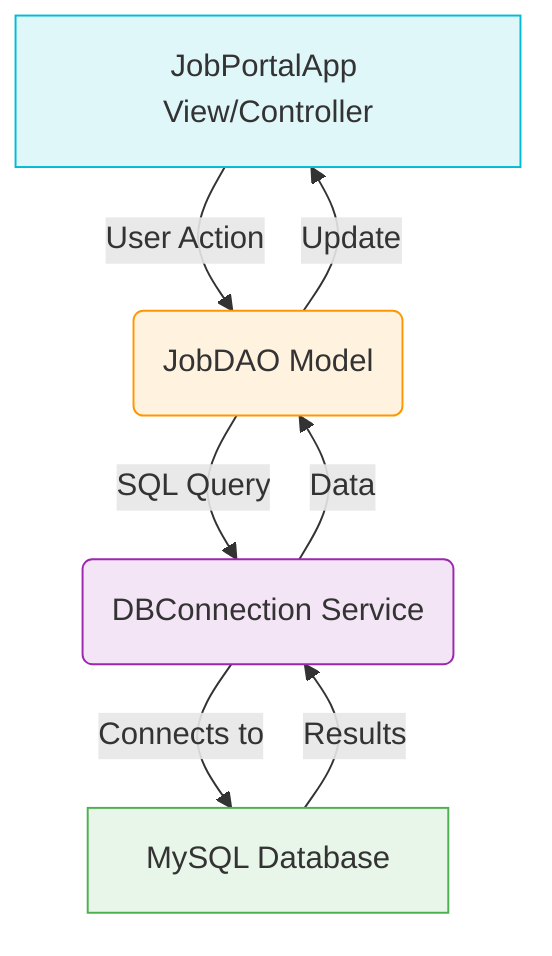

-----

# Online Job Portal – Java Desktop Application

A professional desktop-based **Online Job Portal** application built with **Java Swing** and **MySQL**. This project demonstrates advanced Java programming concepts including **Object-Oriented Design (OOP)**, **Multithreading**, **Database Connectivity (JDBC)**, and robust GUI development using the **MVC + DAO** software architecture patterns.

-----

## Project Overview

This application serves as a comprehensive academic demonstration and a functional proof-of-concept. It enables **employers to post new job listings** and **job seekers to efficiently search and browse** available positions through a responsive graphical user interface.

> **Goal:** To deliver a production-ready application showcasing academic rigor in key Java topics while maintaining a smooth, non-blocking user experience.

-----

## Key Features

### Core Functionality

  * **Job Management:** Employers can add/post new job listings with company and description details.
  * **Job Search:** Real-time, responsive search functionality by job title.
  * **Job Browsing:**  Clean, scrollable interface to view all available jobs.
  * **Self-Initializing:** Automatic MySQL database and table creation upon first run, ensuring minimal setup.

### Technical Excellence

  * **Non-blocking UI:** Achieved using **`SwingWorker`** for all database operations, preventing UI freezes.
  * **Decoupled Architecture:** Implements the **MVC (Model-View-Controller) and DAO (Data Access Object) patterns** for clear separation of concerns.
  * **OOP & Generics:** Extensive use of **Interfaces, Inheritance, Polymorphism**, and **Generics** for strong type safety and extensible design.
  * **Resource Management:** Employs **try-with-resources** for robust, automatic JDBC resource cleanup.

-----

## Technology Stack

| Component | Technology | Description |
| :--- | :--- | :--- |
| **Language** | Java 8+ | Core application logic. |
| **GUI Framework** | Java Swing | Native look-and-feel desktop interface. |
| **Database** | MySQL 5.7/8.0 | Data persistence and storage. |
| **Connectivity** | JDBC (MySQL Connector/J) | Database access layer. |
| **Multithreading** | `SwingWorker` | Asynchronous task execution for non-blocking UI. |
| **Architecture** | MVC + DAO | Software design patterns for maintainability. |
| **Concepts** | OOP, Generics, Collections | Core Java academic topics. |

-----

##  System Architecture (MVC/DAO Flow)

The application follows a structured data flow, ensuring the UI remains responsive and business logic is separated from data access.



-----

## Project Structure

A clean, class-per-concern structure is used for easy navigation and maintenance.

```
Online-Job-Portal/
│
├── src/
│   ├── JobPortalApp.java       # Main GUI Entry Point & Controller logic
│   ├── DBConnection.java       # Handles Database Setup & Connection Management
│   ├── dao/
│   │   └── JobDAO.java         # Data Access Object (CRUD Operations)
│   ├── model/
│   │   ├── Job.java            # Job Entity/Model Class
│   │   ├── Employer.java       # Concrete implementation of PortalUser
│   │   └── PortalUser.java     # Interface for Polymorphism/Abstraction
│
└── README.md                   # Project Documentation
```

-----

## Prerequisites & Setup

### Requirements

  * **Java Development Kit (JDK 8 or higher)**
  * **MySQL Server (5.7 or 8.0)**
  * **MySQL Connector/J JAR** (Required for JDBC connectivity)

### Installation Guide

#### Step 1: Configure Database Credentials

Update the MySQL username and password in the `DBConnection.java` file.

```java
// DBConnection.java snippet
private static final String USER = "your_mysql_username"; 
private static final String PASSWORD = "your_mysql_password"; 
```

#### Step 2: Add MySQL Connector JAR

The Connector/J library must be included in your project's classpath.

  * **For IDE (e.g., Eclipse/IntelliJ):** Add the downloaded `mysql-connector-java-X.X.XX.jar` file to your project's **Build Path/Module Dependencies**.
  * **For Command Line:** Use the `-cp` (classpath) flag during compilation and execution.

#### Step 3: Run the Application

Navigate to the project's source directory (`/src`) and execute the following commands:

```bash
# Compile all Java files
javac JobPortalApp.java DBConnection.java ...

# Run the main application
java JobPortalApp
```

-----

## Database Schema

The application automatically checks for and creates the following tables in the `job_portal` database on startup:

| Table: `jobs` | Type | Constraints |
| :--- | :--- | :--- |
| `id` | `INT` | `AUTO_INCREMENT`, `PRIMARY KEY` |
| `title` | `VARCHAR(100)` | `NOT NULL` |
| `description` | `TEXT` | - |
| `company` | `VARCHAR(100)` | `NOT NULL` |

| Table: `users` | Type | Constraints |
| :--- | :--- | :--- |
| `id` | `INT` | `AUTO_INCREMENT`, `PRIMARY KEY` |
| `name` | `VARCHAR(100)` | `NOT NULL` |
| `email` | `VARCHAR(100)` | `NOT NULL`, `UNIQUE` |
| `user_type` | `ENUM('Employer','JobSeeker')` | `NOT NULL` |

-----

## Usage Guide

### Posting a Job (Employer Mode)

1.  Enter the **Job Title** and **Description**.
2.  Click **"Post Job"**. The operation is executed in a background thread.
3.  Receive a real-time status update/success confirmation in the UI.

### Searching Jobs (Job Seeker Mode)

1.  Enter a search term into the **Search field**.
2.  Click **"Search by Title"**.
3.  The job list is instantly updated with filtered, matching results.

-----

## Future Enhancements

The project is structured for easy extension with the following features:

  * **User Authentication:** Implement secure login/registration for Employers and Job Seekers.
  * **Advanced Filters:** Add search functionality for location, salary, and job type.
  * **Job Application:** Implement a feature for users to "Apply" to a job.
  * **Data Persistence Layer:** Integrate a connection pooling mechanism (e.g., HikariCP) for production-level stability.
